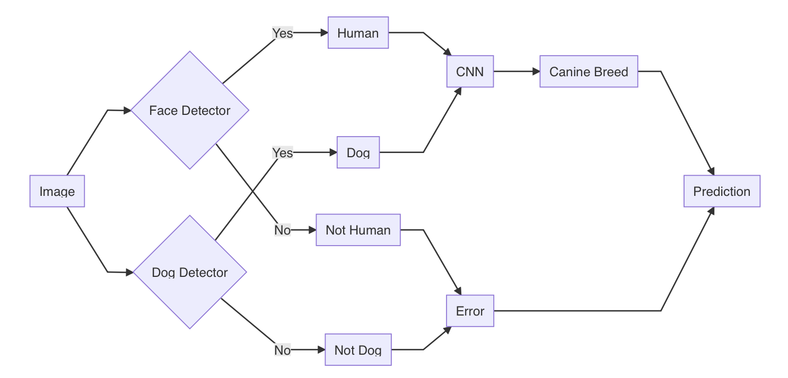

# Dog_Breed_Classifier

Created a machine learning pipeline that is able to predict a canine breed from user-supplied images. The classifier accepts images of both dogs and human beings and provides a prediction of the canine breed for the dog or the closest resembling dog breed in case of receiving a human image. 

To accomplish this task, the classifier relies on two pre-trained networks, one to detect humans and one two detect dogs, as well as on Convolutional Neural Network (CNN) that uses transfer learning to classify dog breeds.   

The proposed solution achieved an 84% accuracy on the testing dataset, which might be considered a good result given the close resemblance between different dog breeds (mininal inter-class variation) and also the high variation within some dog breeds (intra-class variation). 

